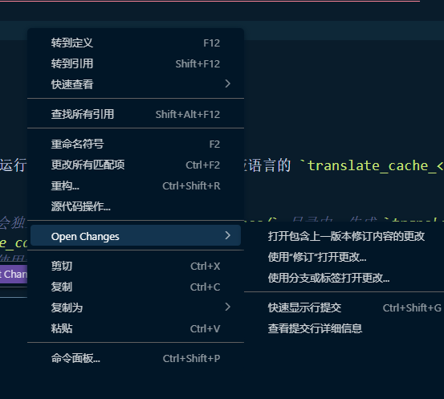
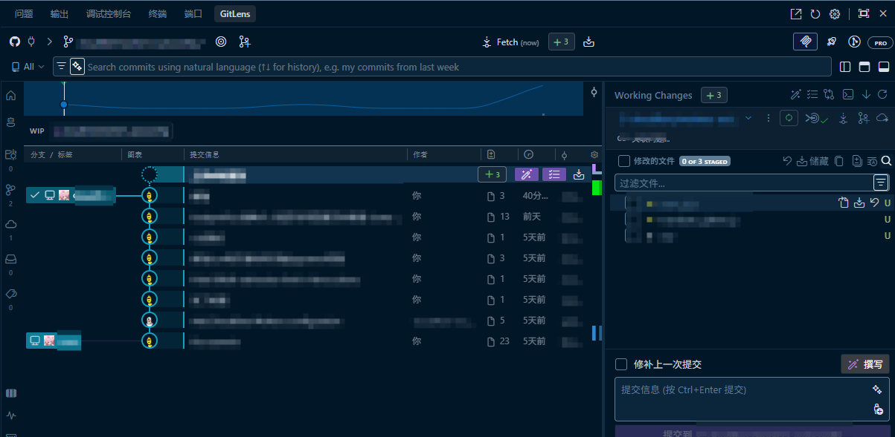
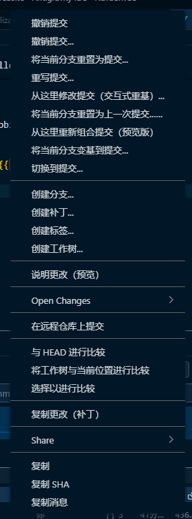
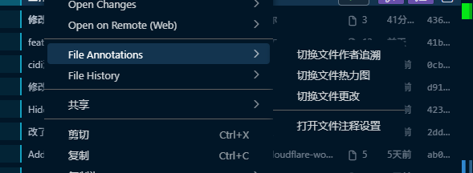

# GitLens Localizer (gitlens-l10n)

English | [简体中文](README.md)

A zero-dependency translation and localization tool for the VS Code GitLens extension, featuring multi-language support, automated caching, and offline recovery.

---

## 📦 Quick Start

1. Clone the repository or download the **Release** package (recommended if you want to use pre-translated cache files).
2. Run `npm install` in the project directory.
3. Open [translate_gitlens.js](file:///c:/Users/Lesli/Desktop/gitlens-l10n/translate_gitlens.js) and modify the `EXTENSION_DIR` path on line 16 to the actual directory of the GitLens version you wish to localize.
4. Execute `npm run translate`.

### Case A - Chinese Localization (Simplified Chinese)
4. Simply press `Enter` to accept all the default prompts.
5. Restart VS Code when done to see the Chinese interface.

### Case B - Other Languages
3. Run `npm run translate`. The script will automatically generate a language cache file named `translate_cache_<lang>.json` in the `caches/` directory during its first run, which will be reused in future runs.

> **Cache Details**: Translation results are saved to the `caches/` directory under the root folder (e.g., `caches/translate_cache_zh.json` for Chinese). Subsequent translation runs will directly match the cached items, significantly speeding up execution and reducing API calls. We highly encourage users of other languages to contribute their cache files to help the community!

---

## 🚀 Script CLI Flow

```text
0️⃣ Select display language (en/zh)
1️⃣ Enter target language code (e.g., zh, ja, fr ...)
2️⃣ Select translation engine (Default: DeepL)
   1. deepl-free (No API Key needed)
   2. deepl-paid (Requires DEEPL_API_KEY environment variable)
   3. google     (Requires GOOGLE_API_KEY environment variable)
3️⃣ Start translating; cached files will be prioritized if they exist.
```

---

## 🛠️ CLI Commands (npm run)

*   **`npm run translate`**
    *   **Action**: Launches the interactive translation helper CLI.
    *   **Details**: Guides you step-by-step to choose the display language, target language, and engine. Recommended for everyday use.
*   **`npm run translate:direct`**
    *   **Action**: Directly runs the translation script, bypassing the interactive CLI.
    *   **Details**: Best for automated scripts. Parameters can be passed directly. E.g.:
        ```bash
        npm run translate:direct -- --target=zh --engine=deepl-free
        ```
        *(Note: Use `--` to forward arguments to the underlying Node.js script. Supported arguments: `--target`, `--engine`, `--display`)*.
*   **`npm run restore`**
    *   **Action**: Restores the GitLens extension back to its original English state.
*   **`npm run clear-cache`**
    *   **Action**: Cleans up all saved translation cache JSON files under the `caches/` directory.

## 🖼️ Screenshots
|  |  |
|  |  |
